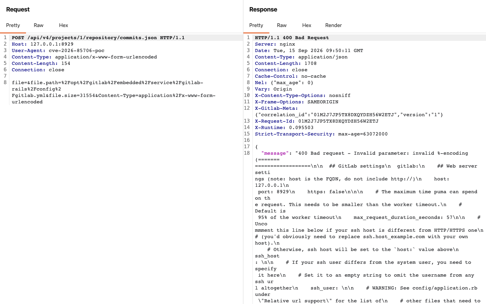
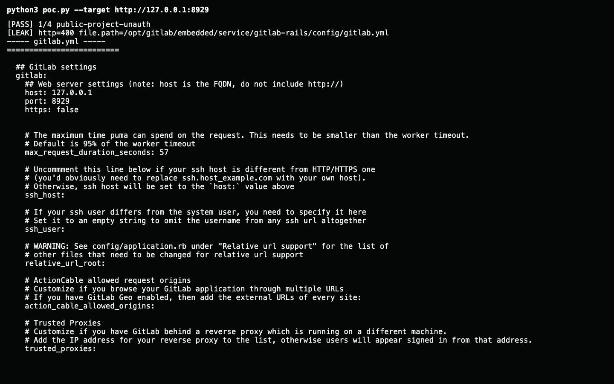

# vuln-screenshot

[](https://github.com/jweny/vuln-screenshot/actions/workflows/ci.yml)
[](https://nodejs.org/)
[](LICENSE)

> **AI reproduced the vulnerability. Why are you still taking screenshots by hand?**

[简体中文](README.zh-CN.md) · [MCP guide](docs/mcp.md) · [Evidence format](docs/evidence-format.md) · [Security model](docs/threat-model.md)

AI-assisted vulnerability research often stops one step before the report is ready:

- The AI runs a PoC but returns only a text summary, making the request, response, and command output difficult to review at a glance.
- The AI drafts the vulnerability report without reproduction screenshots, leaving a human to rerun commands, paste raw requests, and capture the evidence manually.
- Manually produced screenshots are inconsistent, and the visual result is easily separated from the raw evidence behind it.

## Finish the last mile with vuln-screenshot

`vuln-screenshot` lets an AI call a local CLI or [Model Context Protocol](https://modelcontextprotocol.io/) server to:

- send a real raw HTTP/1.1 request and generate a Burp Suite-style request/response screenshot;
- execute a real command in a pseudo-terminal and generate a screenshot containing only the command and its response;
- preserve the original HTTP bytes, terminal stream, normalized text, and a machine-readable manifest;
- produce consistent, report-ready images without asking a human to repeat the reproduction process.

**The AI reproduces the vulnerability. `vuln-screenshot` turns the result into visual, consistent, and reviewable evidence.**

## See it in action

The following images were generated from an authorized local reproduction of GitLab CVE-2026-85706. The target uses a loopback address and the displayed values are demonstration data.

### Raw HTTP request and response



### Command and terminal response



## Why vuln-screenshot?

- **Real inputs, not reconstructed snippets.** Raw request bytes, duplicate headers, bodies, CRLF boundaries, ANSI output, and non-zero exits are preserved.
- **Evidence before decoration.** Screenshots are presentation artifacts; the accompanying raw files remain the source evidence.
- **Built for reports.** HTTP output uses a compact request/response workbench and terminal output contains only the command and its response.
- **CLI and MCP.** Use it from a shell or expose the same capture operations to an MCP-compatible host.
- **Explicit limits.** Truncation, timeouts, render failures, and transport metadata are recorded rather than hidden.

## Requirements

- Node.js 20 or newer
- macOS or Linux
- Chromium installed by Playwright, or a local Google Chrome/Chromium installation

## Install

From the repository:

```bash
git clone https://github.com/jweny/vuln-screenshot.git
cd vuln-screenshot
npm install
npm run install-browser
npm run build
```

After the package is published to npm, it can also be installed globally:

```bash
npm install --global vuln-screenshot
```

On Unix, the postinstall step and command capture both ensure that `node-pty`'s prebuilt helper has the executable bit required to start a PTY. The runtime check also covers package managers that disable dependency install scripts.

## Quick start

Capture a raw HTTP/1.1 request:

```bash
printf 'GET / HTTP/1.1\r\nHost: example.com\r\nConnection: close\r\n\r\n' | \
  vuln-screenshot http --target https://example.com --request -
```

`--target` selects the TCP/TLS destination only. Request bytes are sent unchanged. Use `--request -` to read from stdin and `--insecure` only for an intentionally untrusted or self-signed TLS target.

A reusable request file is available at [`examples/requests/example.raw`](examples/requests/example.raw).

Capture a command:

```bash
vuln-screenshot command --cwd /tmp -- \
  'printf "\033[32mevidence captured\033[0m\n"; uname -a'
```

Commands run as `$SHELL -lc` with the current user's permissions. PTY output merges stdout and stderr, matching a real terminal. Set `VULN_SCREENSHOT_OUTPUT_DIR` to change the default `./artifacts` output root.

When running from a source checkout, replace `vuln-screenshot` with `node dist/cli.js`.

## Evidence bundle

HTTP captures produce:

```text
artifacts/<UTC timestamp>-<UUID>/
├── manifest.json
├── request.raw
├── response.raw
└── screenshots/
    └── 001.png ...
```

Command captures use `command.txt`, `terminal.raw`, and `terminal.txt` instead. Directories use mode `0700` and files use `0600` where the platform supports POSIX permissions.

See [Evidence format](docs/evidence-format.md) for the manifest contract and [Architecture](docs/architecture.md) for the capture pipeline.

## MCP server

Start the stdio server:

```bash
vuln-screenshot mcp
```

It exposes:

- `capture_http_evidence` — send one raw HTTP/1.1 request and preserve the response.
- `capture_command_evidence` — execute one non-interactive command in a host PTY.

See [MCP integration](docs/mcp.md) for configuration and input schemas.

## Limits and security

- HTTP/1.1 only; no redirect, retry, cookie jar, proxy, or request normalization.
- Response and PTY capture limit: 10 MiB.
- Screenshot limit: 100 pages.
- Default timeouts: 30 seconds for HTTP and 60 seconds for commands; maximum 5 minutes.
- Credentials, cookies, commands, and output are preserved **without redaction**.
- Manifests currently do not contain hashes or digital signatures and are not tamper-proof.
- The command tool executes with the current user's full host permissions.

Use the tool only against systems you own or are explicitly authorized to test. Read the [threat model](docs/threat-model.md) before integrating it into an automated agent.

## Development

```bash
npm ci
npm run install-browser
npm run check
npm test
npm run build
npm pack --dry-run
```

Tests use local TCP fixtures and do not require an external target. See [CONTRIBUTING.md](CONTRIBUTING.md) for the contribution workflow.

## License

Licensed under the [Apache License 2.0](LICENSE).
