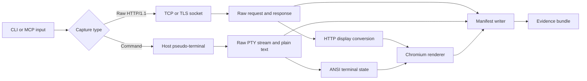

# Architecture

`vuln-screenshot` keeps capture, display conversion, rendering, and artifact persistence separate so that the screenshot never replaces the underlying evidence.

## Components

- `src/cli.ts` parses CLI arguments and selects the capture operation.
- `src/mcp.ts` exposes the same operations as local stdio MCP tools.
- `src/http/raw-capture.ts` sends exact HTTP/1.1 request bytes over TCP or TLS.
- `src/command/pty-capture.ts` executes a non-interactive command in a host PTY.
- `src/http/display.ts` and `src/command/terminal-state.ts` prepare content for presentation without replacing raw files.
- `src/render/` builds fixed-size HTML pages and screenshots them with Chromium.
- `src/artifacts.ts` creates private artifact directories and writes the manifest.

## Design invariants

1. Raw inputs and outputs are written separately from their visual representation.
2. HTTP request bytes are not reconstructed or normalized before transmission.
3. A capture can succeed even when the executed command returns a non-zero exit status.
4. Timeouts and size limits are explicit in the result and manifest.
5. Render failure does not erase already captured raw evidence.
